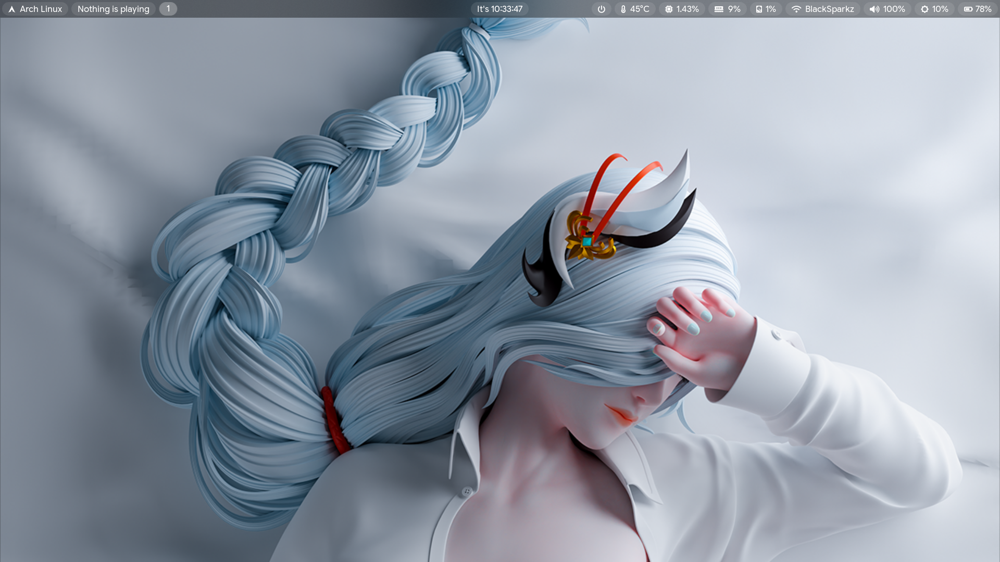

# My Arch dotfiles

> A highly configured, minimal, and aesthetic collection of dotfiles for the [Niri](https://github.com/YaLTeR/niri) scrollable tiling window manager. 

---

## Some screenshots

If you are just browsing, here is what this setup looks like.

| **Desktop & Waybar** |
|:---:|
|  |

| **Rofi launcher** |
|:---:|
|  |

| **OBS Studio** |
|:---:|
|  |

| **Terminal (Alacritty)** |
|:---:|
|  |

| **Audio Visualizer** |
|:---:|
|  |

| **Game Dev (Godot)** |
|:---:|
|  |

| **Main Landing Page** |
|:---:|
|  |

---

## Components

List of all applications and tools that used in this setup.

| **Category** | **Application** | **Description** |
|:---:|:---|:---|
| **Window Manager** | [Niri](https://github.com/YaLTeR/niri) | Infinite scrolling tiling WM for Wayland. |
| **Status Bar** | [Waybar](https://github.com/Alexays/Waybar) | Highly customizable modular status bar. |
| **Terminal** | [Alacritty](https://github.com/alacritty/alacritty) | GPU-accelerated terminal emulator. |
| **Shell** | [Fish](https://fishshell.com/) | User-friendly command line shell. |
| **Prompt** | [Starship](https://starship.rs/) | Cross-shell customizable prompt. |
| **Editor** | [Neovim](https://neovim.io/) | Powered by [NvChad](https://nvchad.com) v2.5. |
| **Launcher** | [Fuzzel](https://codeberg.org/dnkl/fuzzel) | Wayland-native application launcher. |
| **System Monitor** | [Btop](https://github.com/aristocratos/btop) | Resource monitor (Glassy Frost / Material You themes). |
| **File Manager** | [Yazi](https://github.com/sxyazi/yazi) |  Blazing fast terminal file manager (Rust). |
|  | [Ranger](https://github.com/ranger/ranger) | VIM-inspired file manager. |
|  | [Nautilus](https://apps.gnome.org/Nautilus/) | GUI file manager integration. |
| **Notifications** | [Mako](https://github.com/emersion/mako) | Lightweight notification daemon. |
| **Lock Screen** | [Swaylock](https://github.com/swaywm/swaylock) | Screen locker for Wayland. |
| **Logout Menu** | [Wlogout](https://github.com/ArtsyMacaw/wlogout) | Wayland based logout menu. |
| **Media Player** | [MPV](https://mpv.io/) | Video player with `modernz` script. |
| **Visualizer** | [Cava](https://github.com/karlstav/cava) | Console-based audio visualizer with shaders. |
| **Screenshot** | [Swappy](https://github.com/jomo/swappy) | Wayland native snapshot editing tool. |
| **Git Client** | [Lazygit](https://github.com/jesseduffield/lazygit) | Simple terminal UI for git commands. |
| **Notes** | [Obsidian](https://obsidian.md/) | Knowledge base configuration. |
| **Multiplexer** | [Tmux](https://github.com/tmux/tmux) | Terminal multiplexer. |

---

## Essential keybindings

Essential keybindings work across all listed window managers. Explore the configuration file of window manager for the full list of keybindings.

| **Key Combination** | **Action** |
|:---|:---|
| <kbd>Super</kbd> + <kbd>T</kbd> | Open Terminal (`Kitty`) |
| <kbd>Super</kbd> + <kbd>Space</kbd> | Open App Launcher (`Rofi`) |
| <kbd>Super</kbd> + <kbd>Q</kbd> | Quit focused window |
| <kbd>Super</kbd> + <kbd>B</kbd> | Open Browser (`Librewolf`) |
| <kbd>Super</kbd> + <kbd>N</kbd> | Open File Manager (`Yazi`) |
| <kbd>Super</kbd> + <kbd>P</kbd> | Power Menu (`Wlogout`) |
| <kbd>Super</kbd> + <kbd>Ctrl</kbd> + <kbd>E</kbd> | Exit current WC(`Hyprland`) |

---

## Installation

### 1. Requirements
Ensure you have the required packages installed. On Arch Linux:
```bash
sudo pacman -S niri waybar alacritty fish starship neovim btop yazi ranger fuzzel mako swaylock wlogout mpv cava swappy tmux lazygit
```

### 2. Clone Repository
Clone this repository to your minimal dotfiles folder (or directly to `.config` if you prefer manual management, though using `stow` is recommended).

```bash
git clone https://github.com/youngcoder45/new-niri-minimal.git
cd new-niri-minimal
```

### 3. Deploy Configs
Copy the folders to your `~/.config/` directory.

```bash
cp -r niri waybar alacritty fish btop fuzzel mako swaylock wlogout ~/.config/
# Add others as needed
```
