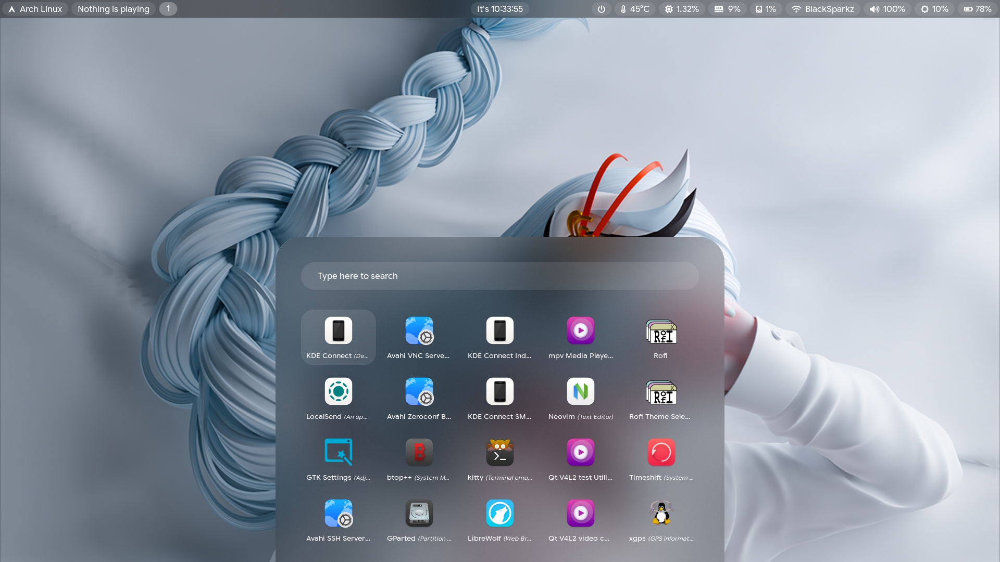
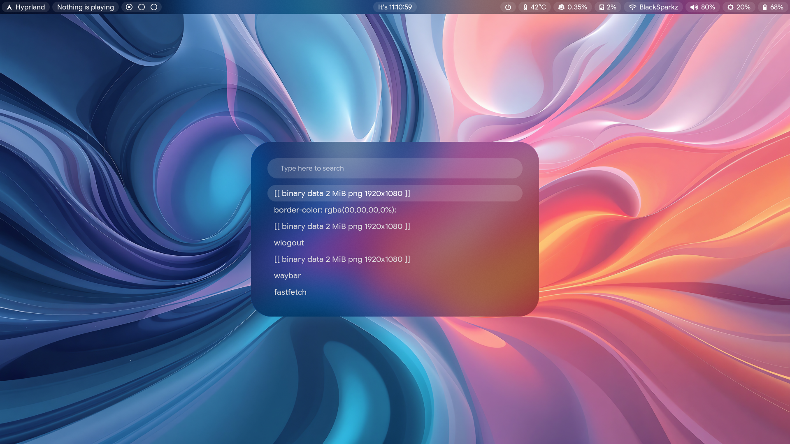
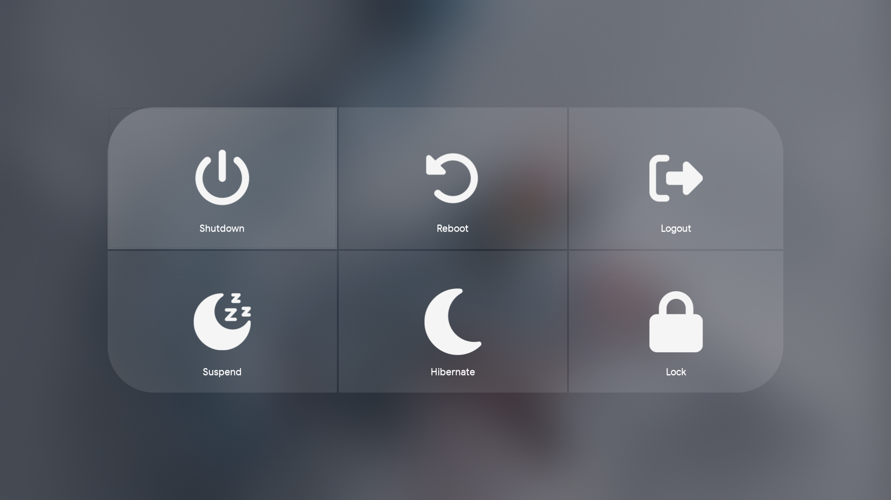
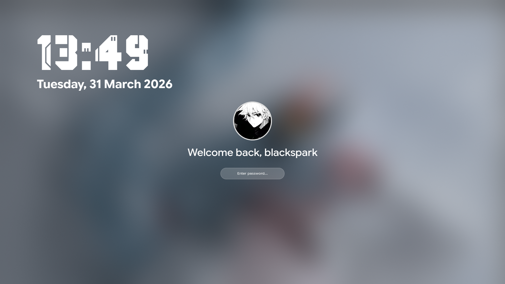

# My Arch dotfiles

## Mango Wayland Compositor
> [MangoWM](https://github.com/mangowm/mango) is as lightweight as dwl, and can be built completely within a few seconds. Despite this, Mango does not compromise on functionality.

## Niri Wayland compositor
> A highly configured, minimal, and aesthetic collection of dotfiles for the [Niri](https://github.com/YaLTeR/niri) scrollable tiling window manager.

## Hyprland Wayland compositor
> [Hyprland](https://github.com/hyprwm/Hyprland) is an independent, highly customizable, dynamic tiling Wayland compositor that doesn't sacrifice on its looks.

## DriftWM Wayland compositor
> [DriftWM](https://github.com/malbiruk/driftwm) is a trackpad-first infinite canvas Wayland compositor.

## Some screenshots

If you are just browsing, here is what this setup looks like.

| **Desktop & Status Bar** |
|:---:|
|  |

| **App launcher** |
|:---:|
|  |

| **Clipboard manager** |
|:---:|
|  |

| **Power menu** |
|:---:|
|  |

| **Screenlock** |
|:---:|
|  |

## Components

List of all applications and tools that used in this setup.

| **Category** | **Application** | **Description** |
|:---:|:---|:---|
| **Window Manager** | [MangoWM](https://github.com/mangowm/mango) | Practical and Powerful wayland compositor (dwm but wayland) |
|  | [Niri](https://github.com/niri-wm/niri) | A scrollable-tiling Wayland compositor. |
|  | [Hyprland](https://github.com/hyprwm/Hyprland) | Hyprland is an independent, highly customizable, dynamic tiling Wayland compositor |
|  | [DriftWM](https://github.com/malbiruk/driftwm) | A trackpad-first infinite canvas Wayland compositor. |
| **Status Bar** | [Waybar](https://github.com/Alexays/Waybar) | Highly customizable modular status bar. |
| **Wallpaper manager** | [SwayBG](https://github.com/swaywm/swaybg) | Wallpaper tool for Wayland compositors |
| **Terminal** | [Kitty](https://github.com/kovidgoyal/kitty) | Kitty - The fast, feature-rich, cross-platform, GPU based terminal |
|  | [Alacritty](https://github.com/alacritty/alacritty) | GPU-accelerated terminal emulator. |
| **Shell** | [Fish](https://fishshell.com/) | User-friendly command line shell. |
| **Editor** | [Neovim](https://neovim.io/) | Powered by [NvChad](https://nvchad.com) v2.5. |
| **Launcher** | [Rofi](https://github.com/davatorium/rofi) | Rofi: A window switcher, application launcher and dmenu replacement |
| **System Monitor** | [Btop](https://github.com/aristocratos/btop) | A monitor of resources. |
| **File Manager** | [Yazi](https://github.com/sxyazi/yazi) |  Blazing fast terminal file manager (Rust). |
| **Notifications** | [Mako](https://github.com/emersion/mako) | Lightweight notification daemon. |
| **Lock Screen** | [Hyprlock](https://github.com/hyprwm/hyprlock/) | Hyprland's GPU-accelerated screen locking utility |
| **Logout Menu** | [Wlogout](https://github.com/ArtsyMacaw/wlogout) | Wayland based logout menu. |
| **Media Player** | [MPV](https://mpv.io/) | Video player with `modernz` script. |
| **Git Client** | [Lazygit](https://github.com/jesseduffield/lazygit) | Simple terminal UI for git commands. |
| **Multiplexer** | [Tmux](https://github.com/tmux/tmux) | Terminal multiplexer. |

## Essential keybindings

Essential keybindings work across all listed wayland compositor.
Explore the wayland compositor’s configuration file for the complete list of keybindings.

| **Key Combination** | **Action** |
|:---|:---|
| <kbd>Super</kbd> + <kbd>T</kbd> | Open Terminal (`Kitty`) |
| <kbd>Super</kbd> + <kbd>Space</kbd> | Open App Launcher (`Rofi`) |
| <kbd>Super</kbd> + <kbd>Q</kbd> | Quit focused window |
| <kbd>Super</kbd> + <kbd>B</kbd> | Open Browser (`Librewolf`) |
| <kbd>Super</kbd> + <kbd>N</kbd> | Open File Manager (`Yazi`) |
| <kbd>Super</kbd> + <kbd>P</kbd> | Power Menu (`Wlogout`) |
| <kbd>Super</kbd> + <kbd>Ctrl</kbd> + <kbd>E</kbd> | Exit wayland compositor |

## Installation

### 1. Requirements
Ensure you have the required packages installed. On Arch Linux:
```bash
sudo pacman -S niri waybar alacritty fish starship neovim btop yazi ranger fuzzel mako swaylock wlogout mpv cava swappy tmux lazygit
```

### 2. Clone Repository
Clone this repository to your minimal dotfiles folder (or directly to `.config` if you prefer manual management, though using `stow` is recommended).

```bash
git clone https://github.com/BlackSparkz/dotfiles.git
cd dotfiles/Configs
```

### 3. Deploy Configs
Copy the folders to your `~/.config/` directory.

```bash
cp -r niri waybar alacritty fish btop rofi mako wlogout ~/.config/
# Add others as needed
```
